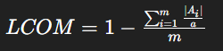

# OrgFin

Eu tenho um problema, quando vou gerir minhas finanças pessoais eu amo o excel por conta de sua flexibilidade e facilidade de uso
mas quando preciso fazer uma compra que não consigo anotar na hora acabo esquecendo e ocorrem inconsistências no final do mês.

Pensei em usar um app, e funcionou por um tempo, mas quando percebi o quão "trancados" eles são decidi abandonar.

Foi ai que nasceu o OrgFin, um projeto pessoal com um nome nem um pouco creativo, com o íntuito de possui um app/site 
para fazer adicionar os dados, e se aproveitando de uma Api Rest para mandar essas mesmas informações ao meu excel pessoal. 

Este repositório se trata de uma aplicação spring rest com integração ao dynamoDb, para armazenamento 
dos dados e ao aws cognito, para fazer a gestão de usuários.

# Repositórios

Repositório de infra(cloudfront) - [OrgFin-infra](https://github.com/PedroPFP/OrgFin-infra)

Repositório de aplicação REST    - [OrgFin-app-transacoesApi](https://github.com/PedroPFP/OrgFin-app-transacoes-api)

Repositório de aplicação Flutter - Não iniciado 

Repositório de aplicação react - Não iniciado

# Arquitetura

- O armazenamento de dados é realizado no dynamoDb, um banco de dados não relacional de propriedade da aws.
- O servidor é hospedado em um EC2 com estância reservada de um ano, visando a economia de custos no longo prazo
- O servidor é gerenciado pelo ECS, um serviço de gerenciamento de containers da aws
- O servidor possui um ASG que, quando o servidor passar de um processamento de 90% de CPU, irá criar uma nova instância em uma availability zone diferente
- Os usuários serão armazenados em um cognito user pool
- O cadastro de transações é realizado em um app flutter, e em uma aplicação web react
- A planilha irá realizar a requisição de todas as transações e transformar em um csv

Para maiores detalhes técnicos da arquitetura, favor ir até o tópico [Características da arquitetura](#características-da-arquitetura)

# Features planejadas

## Infra

- [x] ~~Criação de infra cloudfront para dynamoDb~~
- [x] ~~Criação de infra cloudfront para ECR~~
- [x] ~~Criação de infra cloudfront para cognito user-pool~~
- [x] ~~Criação de infra cloudfront para ECS~~
  - [x] ~~Criação de infra para load balancer~~
  - [x] ~~Criação de infra para ASG~~
  - [x] ~~Contratação de instância reservada~~
- [x] ~~Criação de infra cloudfront para Api-gateway~~
- [ ] Criação de infra para cloudwatch logs

## Api transações

- [x] ~~Integração com dynamoDb~~
  - [x] ~~Leitura de dados~~
  - [x] ~~Escrita de dados~~
- [ ] ~~Integração com cognito user pool~~ (Remapeado)
  - [ ] ~~Validação de usuário existente na user-pool~~ (Remapeado)
- [x] ~~Crud~~
- [x] ~~Implementação de campos de negócio~~ 
- [x] Implementação de campos lógicos
- [X] ~~Validações usando Bean validation~~
- [ ] Criação de logs
- [x] Implementação de securiy
- [ ] Implementação de profiles
- [x] Integração com aws STS para autenticação
- [ ] Limitador de usuários/transações de convidados.

## App mobile flutter

- [ ] Integração com aws Amplify
- [ ] Tela de login com aws Amplify
- [ ] Tela de resumo financeiro
- [ ] Tela de cadastro de transações
- [ ] Tela de alteração de transação
- [ ] Tela de visualização de transações
- [ ] Integração com S3
  - [ ] Salvar imagem relacionada a transação

## App desktop React

- [ ] Integração com aws Amplify
- [ ] Tela de login com aws Amplify
- [ ] Tela de resumo financeiro
- [ ] Tela de cadastro de transações
- [ ] Tela de alteração de transação
- [ ] Tela de visualização de transações
- [ ] Integração com S3
    - [ ] Salvar imagem relacionada a transação

# Campos de negócio

| Informação             | Nome do campo no banco de dados | Tipo    | Exemplos        |
|------------------------|---------------------------------|---------|-----------------|
| **Tipo da transação**  | tp_transacao                    | Enum    | DESPESA,RECEITA |
| Data da transação      | dt_transacao                    | LocalDate | 15-09-2024 20:35
| **Valor da transação** | vl_transacao                    | Double  | 250.32
| **Nome da transação**  | nm_transacao                    | String | Remédios para gripe
| Descrição da transação | desc_transacao                   | String | Remédios para gripe receitados por doutor fulano    
| Tag da transação       | tag_transacao | String | Saúde

Campos em **negrito** são obrigatórios.

# Campos lógicos

| Informação                     | Nome do campo no banco de dados | Tipo      | Exemplos        |
|--------------------------------|---------------------------------|-----------|-----------------|
| **_Id transação_**             | id_transacao                    | UUID      | 71d987a5-29f0-4ffc-bbbb-814f95fa73da |
| **_Id usuário_**               | id_usuario                      | UUID      | 4925adf5-c1aa-4f83-8c7b-12a3163a5d7e
| **_Data de criação_**          | dt_criacao                      | LocalDate | 14-09-2024 14:30
| **Data de última atualização** | dt_ultima_atualizacao           | LocalDate | 15-09-2024 18:50

Campos em **negrito** são obrigatórios.

Campos em _italico_ são imutáveis

# Recursos

| Operação                                                       | Request              | Códigos sucesso | Códigos de erro |
|----------------------------------------------------------------|----------------------| ---------- | --------------- |
| [Listar transações do usuário](#listar-transações-do-usuário ) | GET /transacoes      | 200 | 422                                                                                                                                                                                                 
| [Buscar transação](#buscar-transação)                          | GET /transacoes/{id} | 200 | 422 
| [Adicionar transação](#adicionar-transação)                    | POST /transacoes     | 201 | 400, 422  
| [Alterar transação](#alterar-transação)                        | PUT /transacoes/{id} | 204 | 400, 422
| [Remover transação](#remover-transação)                        | DELETE /transacoes/{id} | 204 | 400

# Contrato API

## Autenticação
O cliente da aplicação deve ter um token autorizado pelo AWS cognito. 
As únicas aplicações que irão gerar este token são a aplicação Web e mobile.

    - Rotas que necessitam de autenticação
    GET /transacoes
    GET /transacoes/{id}
    POST /transacoes
    PUT /transacoes/{id}
    DELETE /transacoes/{id}
    
    - Rotas que não necessitam de autenticação
    GET /actuator/health (Rota utilizada somente para verificação de 
    health check dos containers.)

    headers obrigatórios:
    Authorization

    Exemplo:
    header.Authorization: Bearer <token jwt>

    - Resposta
    1. Falha

    Código: 401 - Unauthorized
    Response:
    {
	  "status": 401,
	  "mensagem": "Token de acesso inválido.",
	  "erros": 
      [
        {
          "campo": "header.Authorization",
          "erro": "Full authentication is required to access this resource"
        }
	  ]
    }

### Listar transações do usuário

    - Requisição
    URI: /transacoes
    Método: GET

    - Resposta
    1. Sucesso

    Código: 200 - Ok
    Response:
    {
        [
            {
                "idTransacao": "string",
                "tipo": "string",
                "data": "date",
                "valor": "number",
                "nome: "string", 
                "descricao": "string",
                "tag": "string"
            }
        ]
    }

    2. Erro de validação

    Código: 404 - Not found
    Body:
    {
        "status": 404.
        "message": "Nenhuma transação encontrada.",
        "errors": []
    }

### Buscar transação

    - Requisição
    URI: /transacoes/{id}
    Método: GET

    - Resposta
    1. Sucesso

    Código: 200 - Ok
    Response:
    {
        "idTransacao": "string",
        "tipo": "string",
        "data": "date",
        "valor": "number",
        "nome: "string", 
        "descricao": "string",
        "tag": "string"
    }

    2. Erro de validação

    Código: 404 - Not found
    Body:
    {
        "status": 404.
        "message": "Nenhuma transação encontrada.",
        "errors": []
    }

### Adicionar transação
    
    - Requisição
    URI: /transacoes
    Método: POST
    Body:
    {
        "tipo": "string",
        "data": "date",
        "valor": "number",
        "nome: "string", 
        "descricao": "string",
        "tag": "string"
    }

    - Resposta
    1. Sucesso

    Código: 201 - Created

### Alterar transação

        - Requisição
        URI: /transacoes/{id}
        Método: PUT
        Body:
        {
            "tipo": "string",
            "data": "date",
            "valor": "number",
            "nome: "string", 
            "descricao": "string",
            "tag": "string"
        }
        
        - Resposta
        1. Sucesso

        Código: 204 - No content
        
        2. Erro de validação

        Código: 404 - Not found
        Body:
        {
            "status": 404.
            "message": "Transação não encontrada",
            "errors": []
        }

### Remover transação

        URI: /transacoes/{id}
        Método: DELETE
        
        - Resposta
        1. Sucesso

        Código: 204 - No content
        
        2. Erro de validação

        Código: 404 - Not found
        Body:
        {
            "status": 404.
            "message": "Transação não encontrada",
            "errors": []
        }

# Características da arquitetura

## Operacionais

### Disponibilidade

Visto que o software não fará um processamento de uma grande quantidade de dados, e que ele deve estar disponível 
para que o usuário consiga fazer os cadastros das transações, a necessidade é que ele esteja disponível das 6:00 as 22:00.
O período de 22:00 - 6:00 pode ser usado para atualizações e manutenções. 

### Continuidade

Temos um ecs que caso uma task falha, ele irá gerar outra automaticamente. Em caso de desastre em uma AZ, iremos lançar 
uma nova instância em outra AZ disponível.

### Desempenho

  Testes a serem realizados:
  - [ ] Teste de estresse.
  - [ ] Teste de tempo de resposta.
  - [ ] Teste de capacidade.

### Recuperabilidade

Por conta da natureza simples do software, e na primeira versão ser um simples CRUD de transações. Não temos necessidade
de um período extremamente curto para recuperar as capacidades.

### Confiabilidade

Teste de estresse pendente.

### Robustez

  Por ser um software inteiramente em cloud, com exceção do aplicativo mobile, em caso de falha física a responsabilidadade
será da AWS para gerir e providenciar o hardware necessário. Em caso de falha de containers ou instâncias haverá retrys,
e caso isso não funcione as task irão subir com uma versão anterior para remediar e diminuir o downtime da aplicação.

### Escalabilidade
  
  Caso necessário o ASG irá gerar uma segunda instância t2.micro, por ser um software com poucos usuários será realizado
  um estudo para entender o motivo do pico de processamento.

## Estruturais

### Configuração

### Extensão

### Instabilidade

### Reusabilidade

### Localização

### Manutenção

### Portabilidade

### Suporte

### Atualização

## Transversais

### Acessibilidade

### Armazenamento

### Instabilidade

### Autenticação

### Autorização

### Legalidade

### Privacidade

### Segurança

### Viabilidade

# Modularidade

## Coesão

  Coesão se refere até que ponto as partes de um módulo devem estar contidas no mesmo módulo, uma coesão alta significa
que poderiamos dividir a classe em mais de uma.

### Fórmula do LCOM96b

LCOM = 1 - ( (|A₁| / a + |A₂| / a + ... + |Aₘ| / a) / m )

#### Onde:

- **m**: número de métodos da classe (excluindo getters/setters triviais)
- **a**: número de atributos (fields) da classe
- **|Aᵢ|**: número de atributos usados pelo método *i*

> **Nota:** Se não houver atributos (`a = 0`) ou métodos (`m = 0`), o valor de **LCOM96b** é definido como **0**.

    github.pedropfp.OrgFin_app_transacoes_api
      OrgFinAppTransacoesApiApplication.java NA
    
      config
        CustomTableNameResolver.java | m=1, a=2, a1 = 2 | = 0
    
      controller
        TransacaoController.java | m=5, a=2, a1 = 1 a2...a5 = 2 | = 0.1 (Métodos privados não são adicionados na conta )
    
        common
          GlobalExceptionHandler.java | m=1, a=0, ... | = 0 ( Desconsiderado por não ter atributos de classe)
    
      model
        TipoTransacao.java | m=0, a=1, ... | = 0 ( Desconsiderado por não ter métodos de classe)
        Transacao.java | m=0, a=7, ... | = 0 ( Desconsiderado por não ter métodos de classe)
    
        dto
          TransacaoDTO.java | m=0, a=7, ... | = 0 ( Desconsiderado por não ter métodos de classe)
    
        erro
          ErroCampo.java | m=0, a=2, ... | = 0 ( Desconsiderado por não ter métodos de classe)
          ErroResposta.java | m=0, a=3, ... | = 0 ( Desconsiderado por não ter métodos de classe, apenas estáticos)
    
        mapper
          TransacaoMapper.java NA
    
      service
        TransacaoService.java | m=5, a=1, a1...a5=1 | = 0 

## Acoplamento

### 1. Abstração (A)

A fórmula da abstração mede o quanto um pacote é abstrato (composto por classes abstratas ou interfaces):

**A = Na / Nc**

Onde:
- **Na**: número de classes abstratas (ou interfaces) no pacote
- **Nc**: número total de classes (abstratas + concretas) no pacote

---

### 2. Instabilidade (I)

A instabilidade mede o quanto um pacote depende de outros pacotes:

**I = Ce / (Ca + Ce)**

Onde:
- **Ce**: Eferente (Efferent Coupling) = número de pacotes dos quais este pacote depende
- **Ca**: Aferente (Afferent Coupling) = número de pacotes que dependem deste pacote

---

### 3. Distância da Reta Principal (D)

A distância da reta principal mede o quão distante o pacote está da zona ideal de equilíbrio entre abstração e estabilidade:

**D = |A + I - 1|**

Onde:
- **A**: Abstração
- **I**: Instabilidade
- **D**: Distância da idealidade (reta principal)

---

    github.pedropfp.OrgFin_app_transacoes_api
      config 
        A = 0, I = 1/4+1 = 0.8 D = 0.2
      controller
        A = 0, I = 1, D = 0
      model
        A = 0.33, I = 0.71 D = 0,04
      service
        A = 0, I = 0.83, D = 0.17